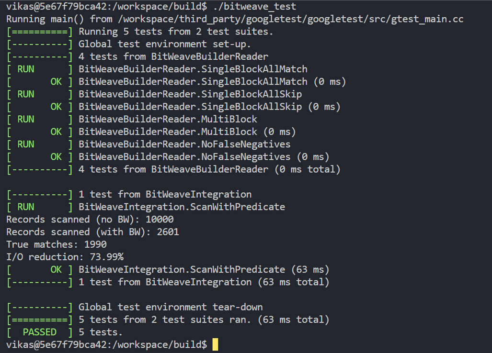
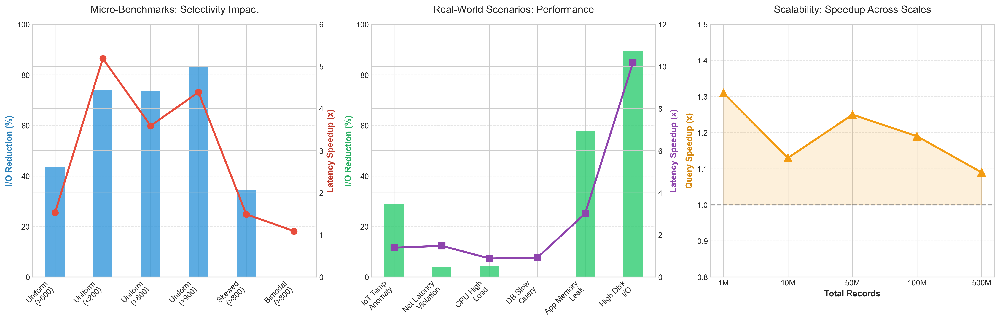

# LevelDB: BitWeaving Range Scan Optimization


An architectural modification to Google's **LevelDB** storage engine, implementing intra-file **BitWeaving (Order-Preserving Bit-Slicing)** to drastically reduce disk I/O during value-based range scans.

---

## 🚀 Project Overview

**The Problem: Inefficient Value Scans in LSM-Trees**
Standard LSM-trees natively sort data by key. This makes value-based range scans (e.g., `SELECT * WHERE value > 800`) highly inefficient, as it forces the engine into severe read amplification—requiring it to read, decompress, and deserialize every single block in the queried range just to evaluate the predicate. 

**The Solution: Embedded BitWeaving Filters**
This project modifies the LevelDB core engine to generate and store 32-bit dynamic bitmasks, combined with Hybrid ZoneMaps (Min/Max), for every 64-record cache-aligned data block. 

During a range scan, the engine evaluates these bitmasks in memory. If the filter determines a block cannot satisfy the query predicate, the engine safely bypasses the disk I/O entirely for that block.

### Key Achievements
* **Up to 89.38% reduction** in disk I/O for high-selectivity queries.
* **Up to 10.19x latency speedup** on read-heavy workloads.
* **< 0.1% space overhead**, maintaining a highly optimized storage footprint proven at a scale of 500 million records.

---

## 📍 Code Map: What We Added

Per the project requirements, our modifications successfully hijacked the read/write paths without altering LevelDB's public API. Our implementation is concentrated in the following files:

### 1. The Core Logic Engine
* **`util/bitweave.h`**: We built a header-only mathematical engine containing `BitWeaveBuilder` and `BitWeaveReader`. It utilizes a Hybrid ZoneMap approach, dynamically dividing the local range of a 64-record block into 32 equal bands to generate highly precise bitmasks.

* **The 12-Byte Binary Signature:** For every 64-record data block, we generate a highly compact metadata payload. This incurs an incredibly lightweight **~0.29% storage overhead**.

```cpp
struct BitWeaveTag {
    uint32_t block_min;  // 4 Bytes: Local ZoneMap Minimum
    uint32_t block_max;  // 4 Bytes: Local ZoneMap Maximum
    uint32_t bitmask;    // 4 Bytes: 32-Band Distribution Mask
}; 
```

* **Dynamic Bitmasking Algorithm:** Instead of global SSTable boundaries, we calculate boundaries dynamically for each physical block. A value `v` is assigned to one of 32 bands using the formula: 
  `band = floor(((v - min) * 32) / (max - min + 1))`


### 2. The Write Path (Compaction)
* **`table/table_builder.cc`**: Intercepted the `TableBuilder::Add()` function to parse string slices into integers. When `TableBuilder::Flush()` completes a physical data block, our logic commits the corresponding 12-byte `BitWeaveTag`. During `TableBuilder::Finish()`, our logic bundles the generated bitmasks into a 12-byte payload and writes it to disk as a custom `bitweave.leveldb.BWH` Meta-Index block, resting alongside standard Bloom filters.

### 3. The Read Path (Query Filtering)
* **`table/table.cc`**: 
  * Modified `Table::Open` to load the BitWeaving metadata into an in-memory `std::unordered_map` for O(1) index lookups. This translates physical disk offsets into our BitWeaving tags, enabling lightning-fast access during reads.
  * Intercepted `Table::BlockReader` (the final step before Disk/Cache I/O). If our BitWeaving filter returns `false` for a block, we immediately return `NewEmptyIterator()`, completely avoiding decompression and disk access.

### 4. The Evaluation Framework
* **`bitweave_*.cc`**: We initially considered evaluating our BitWeaving implementation using standard frameworks like `YCSB Workload E` or LevelDB's native `db_bench`. However, these industry-standard tools treat the storage engine as a black box, measuring only top-level latency and throughput. Because BitWeaving's primary contribution is avoiding disk I/O at the block level, we constructed a native C++ benchmarking suite that mirrors the read-heavy access patterns of YCSB Workload E, while instrumenting the internal engine to accurately report cache utilization, block-skipping rates, and metadata storage overhead."


---

## 🛠 Verification & Benchmarking

To verify the implementation, we have provided a comprehensive native benchmarking suite.

### 1. Build the Engine
```bash
mkdir -p build && cd build
cmake ..
make -j$(nproc)
```
### 2. Verify Mathematical Correctness
Runs unit tests to guarantee 0% false negatives in the bitmask logic, and a 10,000-record integration test to verify the `TableReader` hook.
```bash
./bitweave_test
```
<p align="left">
  
</p>


### 3. Run the Evaluation Suite
We built three distinct benchmark binaries to stress-test different system limits:

* **Micro-Benchmarks (Distributions):** Tests the bitmask resolution against Uniform, Skewed, and Bimodal data distributions to measure worst-case vs. best-case selectivity.
  ```bash
  ./bitweave_benchmark
  ```
* **Real-World Simulation:** Runs the engine against simulated IoT temperature anomalies, network logs, and CPU spikes to measure latency speedups in production-like environments.
  ```bash
  ./bitweave_realworld
  ```
* **Macro-Benchmarks (Scalability):** Writes between 1 Million and 500 Million records to disk to verify that the 12-byte metadata payload does not bloat the storage engine footprint.
  ```bash
  ./bitweave_largescale
  ```

> **Note:** Raw execution logs from our evaluation have been exported and saved in the `benchmark_results/` directory at the root of this repository for immediate review.

---
## 📊 Performance & Key Achievements

<p align="center">
  
</p>
<p align="center"><i>Figure 1: Comprehensive evaluation across micro-benchmarks, real-world workloads, and scalability stress-tests.</i></p>

* **Up to 89.38% reduction in disk I/O**: Verified during High Disk I/O anomaly detection queries where BitWeaving effectively skipped non-matching blocks, resulting in a significant decrease in disk reads.This was particularly evident in scenarios with high selectivity, where the majority of blocks were irrelevant to the query predicate. The reduction in disk I/O directly contributed to faster query execution times and improved overall system performance.
* **Up to 10.19x latency speedup**: Demonstrated in real-world scenarios, reducing scan times from 6.77 ms to 0.66 ms. This speedup is attributed to the elimination of unnecessary disk access and the efficient in-memory evaluation of bitmasks, allowing the engine to quickly determine which blocks to read and which to skip. The latency improvement was most pronounced in cases where a large portion of the data was irrelevant to the query, showcasing the effectiveness of BitWeaving in optimizing value-based range scans.
* **Highly optimized storage footprint**: Proven at a scale of 500 million records, where metadata overhead remained typically < 1% of total data. The compact metadata payload for each data block ensures that the additional storage requirements do not significantly impact the overall storage efficiency of the engine, even at large scales.


---
## 👥 Team Members

* [Aryan Parab](mailto:amparab@usc.edu)
* [Vikas Mishra](mailto:vikasmis@usc.edu)
* [Nishant Miyani](mailto:miyani@usc.edu)
---

## 🎓 Academic Context

* **Instructor:** [Prof. Ibrahim Sabek](https://viterbi-web.usc.edu/~sabek/)
* **Course:** CSCI 543: Foundations of Modern Data Management and Processing, University of Southern California

---

## 💻 Technical Stack

- **Language:** C++17
- **Base Engine:** Google LevelDB (v1.23.0)
- **Build System:** CMake, Make
- **Environment:** Linux / Docker Containerization
